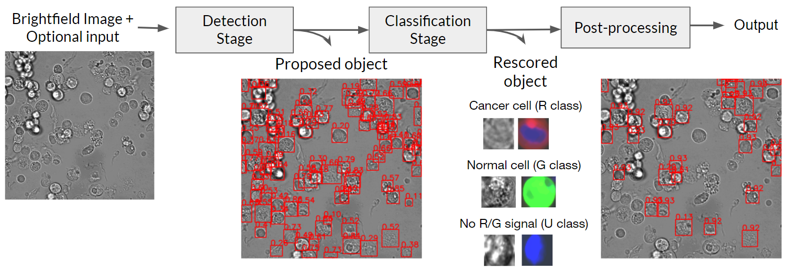

# CancerCellVision-CCA

A code used reproduction of Label-free tumor cells classification using deep learning and high-content imaging.

This git contains two main directories: `detection/` and `classification/`.

The directory `detection/` contains the socure code of a detection stage. Environment setup and usage guide of this directory is in this <a href="https://github.com/cmb-chula/CancerCellVision-CCA/tree/master/detection" title="">link</a>.

The directory `classification/` contains the socure code of classification stage, and evalutaion code for cell and image-level. Enviroment setup and usage guide of this directory is in this <a href="https://github.com/cmb-chula/CancerCellVision-CCA/tree/master/classification" title="">link</a>.

Each directory use different environment. The detection stage is based on MMDetection, an object detection framework based on PyTorch, while the object center adjustment and classification stage are based on PyTorch of diffent version. 

